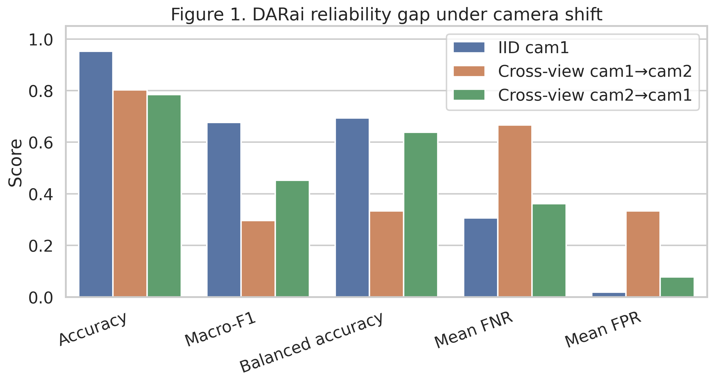
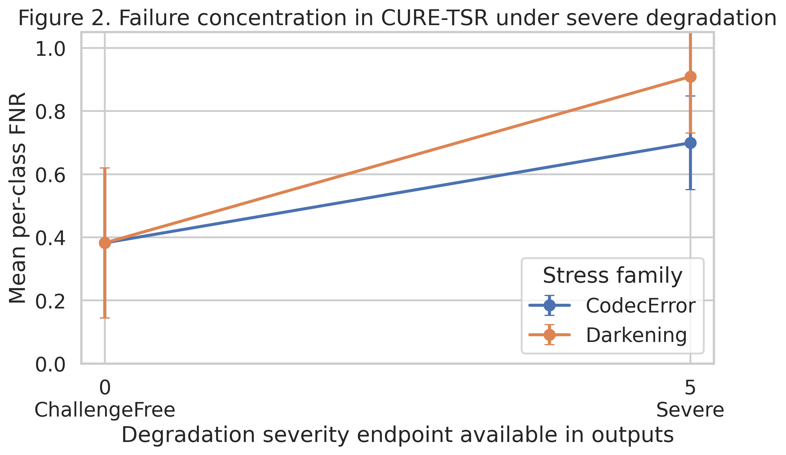
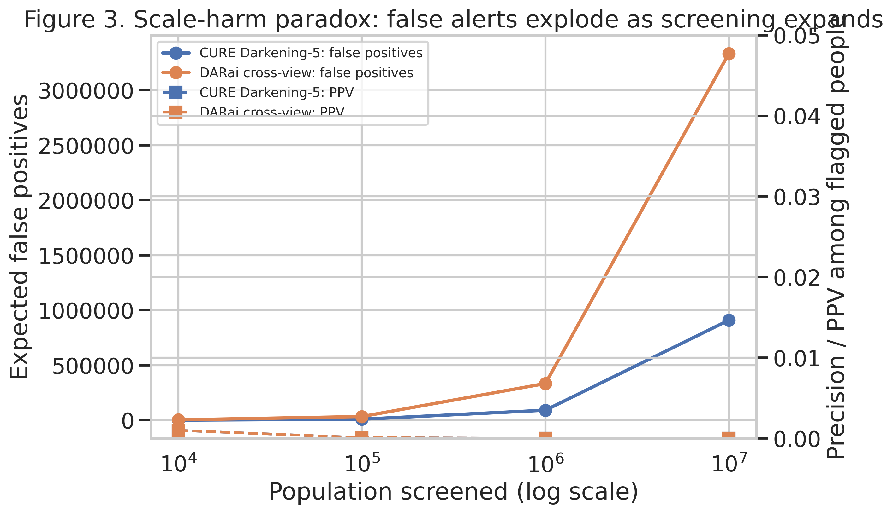
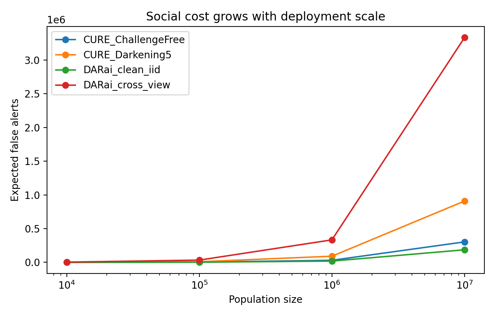
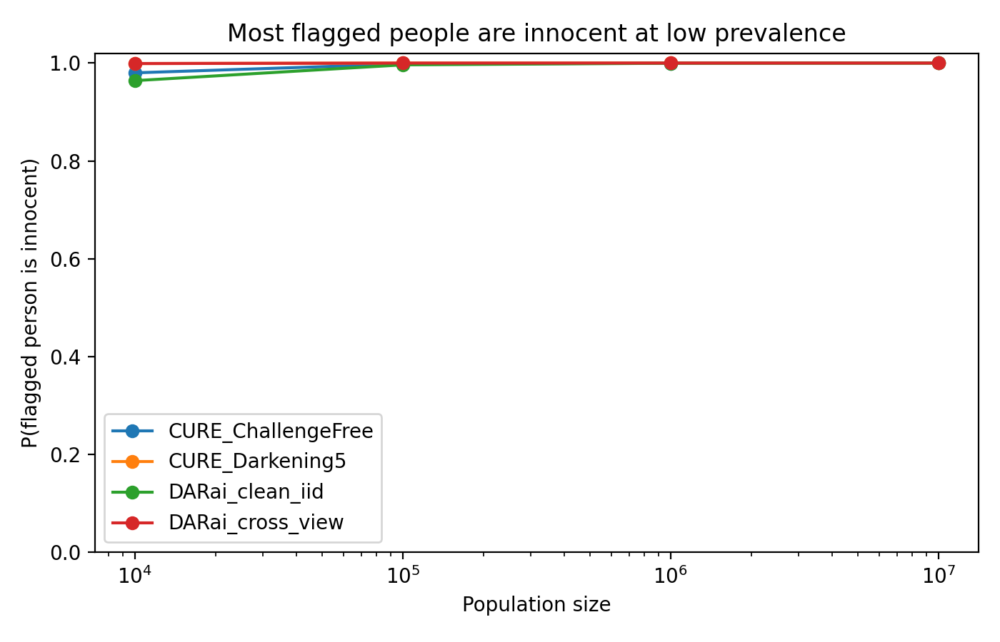

# ECE 6252 Project — Viewpoint A: Rights-First Governance of AI Surveillance

**Position:** AI-enabled mass surveillance should be governed by a rights-first framework, because even technically capable systems produce structural harms at deployment scale.

This repository contains all code and pre-computed results for the three experiments supporting Viewpoint A in the ECE 6252 debate exercise.

---

## Repository structure

```
repo/
├── exp1/                          # Experiment 1: DARai baseline audit
│   ├── darai_exp1_subset_extract.py
│   └── darai_exp1_train.py
├── exp2/                          # Experiment 2: CURE-TSR robustness stress test
│   ├── cure_tsr_dataset.py
│   ├── train_cure_tsr_baseline.py
│   ├── exp2_robustness_audit.py
│   └── darai_exp2_selective_extract.sh
├── exp3/                          # Experiment 3: Population-scale simulation
│   └── exp3_population_scale_simulation.py
├── figures/
│   └── generate_figures.py
├── results/
│   ├── exp1/
│   ├── exp2/
│   ├── exp3/
│   └── figures/
└── requirements.txt
```

---

## Datasets

| Dataset | Location | Access |
|---------|----------|--------|
| **DARai RGB** | PACE cluster: `.../Dataset/DARai/RGB_pt1/RGB_pt1_compressed.zip` | [darai.gatech.edu](https://darai.gatech.edu/) |
| **CURE-TSR** | Shared storage: `/storage/ice1/shared/d-pace_community/makerspace-datasets/AVs/CURE-TSR` | [github.com/olivesgatech/CURE-TSR](https://github.com/olivesgatech/CURE-TSR) |

---

## Setup

```bash
python3 -m venv .venv
source .venv/bin/activate
pip install -r requirements.txt
```

Python 3.9+. Training (Exp 1, 2) benefits from GPU. Exp 3 is CPU-only.

---

## Experiment 1 — DARai Baseline Audit

**Core claim:** Aggregate accuracy hides deployment instability across camera views.

### What we did

We trained a ResNet-18 classifier on the DARai RGB dataset for activity recognition
(3 classes: Making pancake, Reading, Working on a computer). We evaluated under two conditions:

- **IID:** Train and test on the same camera (camera\_1\_fps\_15)
- **Cross-view:** Train on camera 1, test on camera 2 — simulating real deployment where a
  system trained in one location is moved or expanded to a new viewpoint

### Results

| Condition | Accuracy | Macro-F1 | Balanced Acc |
|-----------|----------|----------|--------------|
| IID cam1 | 0.952 | 0.677 | 0.694 |
| Cross-view cam1 → cam2 | 0.803 | 0.297 | 0.333 |

Under cross-view: "Reading" F1 = 0.0, "Working on a computer" F1 = 0.0.
Balanced accuracy drops to 0.333 — equivalent to random guessing across 3 classes.

### Figure 1 — DARai Reliability Gap



**How this figure was generated:**
`figures/generate_figures.py` reads `runs.zip` (archived Exp 1 outputs: `metrics_overall.json`
and `per_class_metrics.csv` for all three run conditions). It plots a grouped bar chart of
Accuracy, Macro-F1, Balanced Accuracy, Mean FNR, and Mean FPR side-by-side for IID vs.
both cross-view conditions. Generated with seaborn `barplot`, saved at 300 dpi.

### How to reproduce

**Step 1 — Extract frames**
```bash
python exp1/darai_exp1_subset_extract.py extract \
  --zip /home/hice1/mshon6/scratch/ECE6252_project/Dataset/DARai/RGB_pt1/RGB_pt1_compressed.zip \
  --out-root /home/hice1/mshon6/scratch/ECE6252_project/Dataset/DARai/RGB_pt1/exp1_rgb_baseline/subset_rgb \
  --manifest /home/hice1/mshon6/scratch/ECE6252_project/Dataset/DARai/RGB_pt1/exp1_rgb_baseline/subset_rgb/manifest.csv \
  --activity "Making pancake" --activity "Reading" --activity "Working on a computer" \
  --camera camera_1_fps_15 --camera camera_2_fps_15 \
  --frame-step 3
```

**Step 2 — Train IID**
```bash
python exp1/darai_exp1_train.py \
  --manifest .../subset_rgb/manifest.csv \
  --outdir .../runs/iid_cam1 \
  --split-mode iid --train-camera camera_1_fps_15 \
  --activities "Making pancake" "Reading" "Working on a computer" \
  --epochs 8
```

**Step 3 — Train cross-view**
```bash
python exp1/darai_exp1_train.py \
  --manifest .../subset_rgb/manifest.csv \
  --outdir .../runs/cross_view_cam1_to_cam2 \
  --split-mode cross_view \
  --train-camera camera_1_fps_15 --test-camera camera_2_fps_15 \
  --activities "Making pancake" "Reading" "Working on a computer" \
  --epochs 8
```

---

### Extension — R3D-18 video model (rebuttal to "use a better model")

**Motivation:** ResNet-18 treats each frame independently. A natural objection is that a
proper video model — one that learns temporal relationships across frames — would overcome
the cross-view failure. We tested this directly.

**Model:** R3D-18 (3D ResNet from `torchvision.models.video`), processing 16-frame clips as
`(C, T, H, W)` tensors. Clips are built with a sliding window (stride=8) over sorted frames
within each `group_id`. This is the architecture designed for exactly the task we are testing.

**Script:** `exp1/darai_exp1_clip_train.py` — supports `--model {resnet18_clip_avg, r3d18}`.

#### Results

| Model | Condition | Accuracy | Macro-F1 | Balanced Acc |
|-------|-----------|----------|----------|--------------|
| ResNet-18 | IID cam1 | 0.952 | 0.677 | 0.694 |
| ResNet-18 | Cross-view cam1 → cam2 | 0.803 | 0.297 | 0.333 |
| R3D-18 | IID cam1 | 0.855 | 0.462 | 0.667 |
| R3D-18 | Cross-view cam1 → cam2 | 0.810 | 0.306 | **0.333** |

Per-class cross-view (R3D-18): "Reading" F1 = 0.0, "Working on a computer" F1 = 0.0.
Balanced accuracy = 0.333 — identical to ResNet-18 cross-view, equivalent to random guessing.

**Key finding:** Upgrading from a frame-level classifier to a full spatiotemporal video model
produces no improvement on cross-view evaluation. The failure is not an architectural limitation
of ResNet-18 — it is a structural property of deploying any model on viewpoints it was not
trained on.

#### How to reproduce

**Step 1 — Extract frames** (same as ResNet-18, Step 1 above)

**Step 2 — Train R3D-18 IID**
```bash
python exp1/darai_exp1_clip_train.py \
  --manifest .../subset_rgb/manifest.csv \
  --outdir .../runs/r3d18_iid \
  --split-mode iid --train-camera camera_1_fps_15 \
  --activities "Making pancake" "Reading" "Working on a computer" \
  --model r3d18 --clip-len 16 --clip-stride 8 \
  --epochs 8
```

**Step 3 — Train R3D-18 cross-view**
```bash
python exp1/darai_exp1_clip_train.py \
  --manifest .../subset_rgb/manifest.csv \
  --outdir .../runs/r3d18_cross_view \
  --split-mode cross_view \
  --train-camera camera_1_fps_15 --test-camera camera_2_fps_15 \
  --activities "Making pancake" "Reading" "Working on a computer" \
  --model r3d18 --clip-len 16 --clip-stride 8 \
  --epochs 8
```

Results are written to `runs/r3d18_iid/` and `runs/r3d18_cross_view/` in the same format
as the ResNet-18 runs (`metrics_overall.json`, `per_class_metrics.csv`, `confusion_matrix.png`).

---

## Experiment 2 — CURE-TSR Robustness Stress Test

**Core claim:** Environmental degradation produces predictable and concentrated failure.

### What we did

We trained a ResNet-18 on CURE-TSR traffic sign images under clean conditions
(ChallengeFree split), then evaluated the same model — without retraining — on two
stress conditions at maximum severity (level 5):

- **Darkening-5:** Simulated severe low-light / nighttime conditions
- **CodecError-5:** Simulated compression artifacts from low-quality video encoding

This mirrors real surveillance: a model deployed from a controlled setting encounters
uncontrolled lighting and compressed video streams.

### Results

| Condition | Accuracy | Macro-F1 | Balanced Acc | Mean FNR |
|-----------|----------|----------|--------------|----------|
| ChallengeFree | 0.768 | 0.622 | 0.618 | 0.382 |
| Darkening-5 | 0.358 | 0.048 | 0.091 | **0.909** |
| CodecError-5 | 0.451 | 0.265 | 0.301 | 0.699 |

Under Darkening-5: macro-F1 drops from 0.622 to 0.048. The model misses 9 out of 10
targets on average. Failure is not distributed — it is concentrated and catastrophic.

### Figure 2 — CURE-TSR Failure Concentration



**How this figure was generated:**
`figures/generate_figures.py` reads per-class FNR CSVs from `exp2.zip`
(`cure_runs/baseline_cf/ChallengeFree/per_class_metrics.csv`, `Darkening-5/...`, `CodecError-5/...`).
It plots mean per-class FNR with 95% confidence intervals (1.96 × std / √n) as a line chart,
with severity on the x-axis (0 = ChallengeFree, 5 = severe), one line per stress family
(Darkening, CodecError). Generated with matplotlib `errorbar`, saved at 300 dpi.

### How to reproduce

**Step 1 — Build manifests**
```bash
python exp2/cure_tsr_dataset.py build-manifest \
  --root /storage/ice1/shared/d-pace_community/makerspace-datasets/AVs/CURE-TSR \
  --split Real_Train \
  --out /home/hice1/mshon6/scratch/ECE6252_project/exp2/cure_train_manifest.csv

python exp2/cure_tsr_dataset.py build-manifest \
  --root /storage/ice1/shared/d-pace_community/makerspace-datasets/AVs/CURE-TSR \
  --split Real_Test \
  --out /home/hice1/mshon6/scratch/ECE6252_project/exp2/cure_eval_manifest.csv
```

**Step 2 — Train and evaluate**
```bash
python exp2/train_cure_tsr_baseline.py \
  --train-manifest .../cure_train_manifest.csv \
  --eval-manifest .../cure_eval_manifest.csv \
  --outdir .../exp2/cure_runs/baseline_cf \
  --train-conditions ChallengeFree \
  --eval-conditions ChallengeFree Darkening-5 CodecError-5 \
  --epochs 8
```

**Step 3 — Unified robustness audit (DARai + CURE together)**
```bash
python exp2/exp2_robustness_audit.py \
  --outdir .../exp2/results \
  --darai-checkpoint .../runs/iid_cam1/best_model.pt \
  --cure-checkpoint .../cure_runs/baseline_cf/best_model.pt
```

---

## Experiment 3 — Population-Scale Simulation

**Core claim:** Small error rates become large social costs at population scale.

### What we did

We took the empirical FPR and FNR from Exp 1 and Exp 2 and simulated deployment
at city scale: 1,000,000 people screened, 10 true targets (a realistic ratio for
threat identification). We computed expected false alerts, expected true detections,
and the probability that any flagged person is innocent — using both exact calculation
and 5,000-trial Monte Carlo simulation. We also swept population sizes from 10K to 10M
to show how social cost grows with scale.

### Results (population = 1,000,000, true targets = 10)

| System | Expected false alerts | P(flagged is innocent) | False alerts per true positive |
|--------|-----------------------|------------------------|-------------------------------|
| DARai clean IID | 18,613 | 0.9996 | 2,683 |
| DARai cross-view | 333,330 | 0.9999 | 99,999 |
| CURE ChallengeFree | 30,329 | 0.9998 | 4,910 |
| CURE Darkening-5 | 90,908 | 0.9999 | 99,999 |

In every scenario, over 99.96% of all flagged individuals are innocent.

### Figure 3 — Scale-Harm Paradox



**How this figure was generated:**
`figures/generate_figures.py` reads `exp3_population_scaling.csv` from `exp3.zip`, filters
to the two worst-performing systems (DARai cross-view, CURE Darkening-5), and plots a
dual-axis chart: left axis = expected false positives (log-scale x-axis, population size),
right axis = precision/PPV among flagged people. Solid lines = false positives;
dashed lines = PPV. Shows both the absolute harm growth and the near-zero precision
simultaneously. Saved at 300 dpi.

### Supporting figures

**False alerts vs. population (all four systems):**



**P(flagged person is innocent) vs. population:**



**How these were generated:**
`exp3/exp3_population_scale_simulation.py` runs the simulation directly and saves
these plots to the `exp3/` output directory. `false_alerts_vs_population.png`
plots expected FP across population sizes for all four systems on a log-x scale.
`innocent_share_vs_population.png` plots P(flagged is innocent) — stays near 1.0
across all scales.

### How to reproduce (CPU only — no dataset needed)

```bash
python exp3/exp3_population_scale_simulation.py \
  --exp2-summary /home/hice1/mshon6/scratch/ECE6252_project/exp2/results/exp2_summary.json \
  --outdir /home/hice1/mshon6/scratch/ECE6252_project/exp3 \
  --population 1000000 \
  --true-targets 10 \
  --populations 10000 100000 1000000 10000000 \
  --trials 5000 \
  --seed 42
```

---

## Regenerate paper figures

```bash
python figures/generate_figures.py \
  --runs-zip /home/hice1/mshon6/scratch/ECE6252_project/runs.zip \
  --exp2-zip /home/hice1/mshon6/scratch/ECE6252_project/exp2.zip \
  --exp2-condition-csv /home/hice1/mshon6/scratch/ECE6252_project/exp2_condition_summary.csv \
  --exp3-zip /home/hice1/mshon6/scratch/ECE6252_project/exp3.zip \
  --outdir /home/hice1/mshon6/scratch/ECE6252_project/figures_out
```

---

## Argument summary (Viewpoint A)

These three experiments form a single chain of evidence:

1. **Exp 1** — Average performance hides view-dependent instability. A model that appears accurate on benchmark data collapses under realistic deployment shifts.
2. **Exp 2** — Failures are not random. They concentrate under common real-world conditions (lighting, compression), making the system unreliable precisely when and where it is most likely to be used.
3. **Exp 3** — Technical error becomes social harm at scale. Even the best-performing system flags approximately 2,683 innocent people for every 1 correctly identified target when screening 1 million people. Degraded systems reach 99,999:1.

**Core governance claim:** These patterns are structural, not incidental. The burden of proof must rest with the deployer to demonstrate rights-compatibility before deployment — not after harm occurs.

---

## Citation / acknowledgements

- DARai dataset: [https://darai.gatech.edu/](https://darai.gatech.edu/)
- CURE-TSR dataset: Temel et al., "CURE-TSR: Challenging Unreal and Real Environments for Traffic Sign Recognition", NeurIPS Workshop 2017. [https://github.com/olivesgatech/CURE-TSR](https://github.com/olivesgatech/CURE-TSR)
